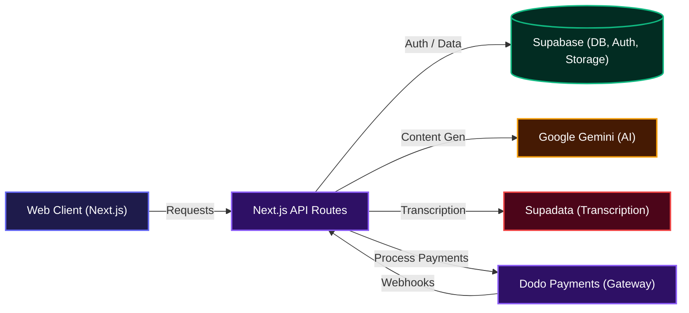

# Postmorph

## Overview

Postmorph is a smart tool that helps content creators and marketers get more from their content. You give it your existing content, like a blog post or video, and it quickly transforms it into various formats for different platforms, saving you tons of time and effort. It's all about making content creation straightforward and efficient.

## Features

*   **Intelligent Content Repurposing**: Effortlessly transform long-form content like blog posts or videos into bite-sized social media updates, threads, and more.
    ```mermaid
    sequenceDiagram
        actor User
        participant WebClient as "Web Client"
        participant NextJSAPI as "Next.js API"
        participant Supabase as "Supabase DB"
        participant GoogleGemini as "Google Gemini AI"
        participant Supadata as "Supadata Transcription"

        User->>WebClient: Enter content & choose format
        WebClient->>NextJSAPI: POST /api/repurposeContent
        NextJSAPI->>Supabase: Check user credits
        alt Input is Video URL
            NextJSAPI->>Supadata: Get video transcript
            Supadata-->>NextJSAPI: Return transcript
        else Input is Blog URL
            NextJSAPI->>NextJSAPI: Fetch blog content
        end
        NextJSAPI->>GoogleGemini: Repurpose content prompt
        GoogleGemini-->>NextJSAPI: Return repurposed text
        NextJSAPI->>Supabase: Save new draft & update credits
        Supabase-->>NextJSAPI: Confirmation
        NextJSAPI-->>WebClient: Return new draft
        WebClient->>User: Display repurposed content
    ```
*   **Multi-Platform Output**: Generate tailored content for various platforms including X (formerly Twitter) threads, individual tweets, LinkedIn posts, and Reddit posts.
*   **Video-to-Text Transcription**: Automatically transcribe and summarize content from YouTube and TikTok videos, turning spoken words into editable text.
*   **AI-Powered Content Refinement**: Easily modify and enhance your drafts with AI suggestions to fit different tones or specific requirements.
*   **Custom Brand Voices**: Define and apply unique writing styles and instructions to ensure all repurposed content consistently reflects your brand's voice.
*   **Draft Management**: Save, organize, edit, and delete your generated content drafts, giving you full control over your creative process.
*   **Flexible Credit System**: Operate on a convenient pay-as-you-go model, purchasing credits as needed without commitment to subscription fees.
    ```mermaid
    sequenceDiagram
        actor User
        participant WebClient as "Web Client"
        participant NextJSAPI as "Next.js API"
        participant DodoPayments as "Dodo Payments"
        participant Supabase as "Supabase DB"

        User->>WebClient: Select credit pack
        WebClient->>NextJSAPI: POST /api/createCheckout
        NextJSAPI->>DodoPayments: Create checkout session
        DodoPayments-->>NextJSAPI: Return checkout URL
        NextJSAPI-->>WebClient: Redirect URL
        WebClient->>User: Redirect to Dodo Payments
        User->>DodoPayments: Complete payment
        DodoPayments->>NextJSAPI: Webhook: payment.succeeded
        NextJSAPI->>NextJSAPI: Verify webhook signature
        NextJSAPI->>Supabase: Add credits to user
        Supabase-->>NextJSAPI: Confirmation
        DodoPayments-->>WebClient: Redirect to /pricing?payment_id=...
        WebClient->>User: Display payment status
    ```
*   **Integrated Learning Center**: Access comprehensive guides and resources to master content repurposing and maximize your results.

## System Architecture / Design

Here's a high-level look at how Postmorph's main components interact to deliver content repurposing magic.



## Getting Started

To get Postmorph up and running locally, follow these steps:

### Installation

1.  **Clone the Repository**:
    ```bash
    git clone git@github.com:Charmingdc/postmorph
    ```
2.  **Navigate to the project directory**:
    ```bash
    cd postmorph
    ```
3.  **Install dependencies**:
    Using npm:
    ```bash
    npm install
    ```
    Using yarn:
    ```bash
    yarn install
    ```

### Environment Variables

You'll need to set up your environment variables. Copy the `.env.template` file to `.env.local` and fill in the necessary details.

```bash
cp .env.template .env.local
```

Here are the variables you'll need:

| Variable | Description | Example Value |
| :-------------------------------- | :----------------------------------------------------- | :--------------------------------------------- |
| `NEXT_PUBLIC_APP_URL` | The public URL of your Next.js application. | `http://localhost:3000` |
| `NEXT_PUBLIC_SUPABASE_URL` | Your Supabase project URL. | `https://your-project-id.supabase.co` |
| `NEXT_PUBLIC_SUPABASE_ANON_KEY` | Your Supabase public anon key. | `your-supabase-anon-key` |
| `SUPABASE_SERVICE_ROLE_KEY` | Your Supabase service role key (for server actions). | `your-supabase-service-role-key` |
| `GOOGLE_GENERATIVE_AI_API_KEY` | API key for Google Gemini AI. | `your-google-ai-api-key` |
| `SUPADATA_API_KEY` | API key for Supadata (for video transcription). | `your-supadata-api-key` |
| `DODO_PAYMENTS_API_KEY` | API key for Dodo Payments. | `your-dodopayments-api-key` |
| `DODO_PAYMENTS_WEBHOOK_KEY` | Webhook secret for Dodo Payments. | `your-dodo-payment-webhook-secret` |
| `DODO_PAYMENTS_ENVIRONMENT` | The environment for Dodo Payments (`live_mode` or `test_mode`). | `test_mode` |

## Usage

Once you've installed the dependencies and configured your environment variables, you can start the development server:

```bash
npm run dev
# or
yarn dev
```

Open your browser and navigate to `http://localhost:3000`.

From the landing page, you can learn more about Postmorph or sign up to start transforming your content.

### Content Repurposing Workflow

1.  **Sign Up/Sign In**: Create an account or log in to access the dashboard.
2.  **Navigate to "Repurpose New"**: In the dashboard sidebar, select "Repurpose New."
3.  **Choose Formats**:
    *   Select your "Input Format" (e.g., "blog", "youtube video", "x thread").
    *   Choose your desired "Output Format" (e.g., "tweet", "linkedin post").
    *   Pick a "Tone" that fits your needs. You can use default tones or create custom ones.
4.  **Provide Content**: Paste a link (for videos/blogs) or the text content into the input area.
5.  **Repurpose**: Click "Repurpose Now" and let the AI work its magic.
6.  **Review and Edit**: Your new draft will appear. You can copy it, or click the edit icon to open it in the editor for further adjustments.

## API Documentation

Postmorph uses Next.js API Routes to handle its backend logic. Here's how you can interact with its API.

#### POST /api/createCheckout
**Description**: Initiates a checkout session with Dodo Payments for purchasing credits. This endpoint generates a unique URL that redirects the user to Dodo Payments to complete the transaction.

**Request**:
```json
{
  "planId": "pdt_0Nb8g2a0s5YKJEiEoU1VE",
  "customerName": "John Doe",
  "customerEmail": "john.doe@example.com",
  "userId": "uuid-of-the-user",
  "credits": 35,
  "planName": "starter"
}
```

**Response**:
```json
{
  "url": "https://pay.dodopayments.com/checkout/sess_your_session_id"
}
```

**Errors**:
- 400: Missing required fields such as `planId`, `customerName`, `customerEmail`, or `userId`.
- 500: An internal server error occurred during checkout session creation, potentially due to issues with the Dodo Payments API or configuration.

#### GET /api/getDrafts
**Description**: Retrieves a paginated list of content drafts associated with a specific user. This is useful for displaying recent or all drafts on the dashboard or drafts page.

**Query Parameters**:
- `userId` (string, required): The unique identifier of the user whose drafts are to be fetched.
- `from` (number, optional, default: 0): The starting index for pagination.
- `to` (number, optional, default: 9): The ending index for pagination.

**Example Request**:
```
GET /api/getDrafts?userId=your-user-id-here&from=0&to=9
```

**Response**:
```json
{
  "drafts": [
    {
      "id": "draft_uuid_1",
      "type": "tweet",
      "modify_count": 0,
      "content": "This is a repurposed tweet content example.",
      "createdAt": "2024-07-20T10:00:00Z"
    },
    {
      "id": "draft_uuid_2",
      "type": "x thread",
      "modify_count": 1,
      "content": "First tweet in thread.--tweet break--Second tweet in thread.",
      "createdAt": "2024-07-19T11:30:00Z"
    }
  ]
}
```

**Errors**:
- 400: The `userId` query parameter is missing from the request.
- 500: A database error occurred while trying to retrieve the drafts.

#### POST /api/modifyDraft
**Description**: Refines an existing content draft using an AI model based on a provided prompt. This action consumes user credits and updates the `modify_count` for the draft.

**Request**:
```json
{
  "prompt": "Make this draft more concise and add a call to action.",
  "draftId": "existing-draft-uuid"
}
```

**Response**:
```json
{
  "text": "The refined and concise draft content with a call to action.",
  "modifyCount": 1
}
```

**Errors**:
- 400: The `prompt` or `draftId` is missing from the request body.
- 401: User authentication failed or the user is not signed in.
- 403: The user does not have enough credits to perform the modification.
- 404: The specified `draftId` was not found or does not belong to the authenticated user.
- 500: An internal server error occurred, possibly during AI content generation or while updating the draft/user credits in the database.

#### POST /api/repurposeContent
**Description**: Transforms content from one platform format (e.g., blog, YouTube video) into another (e.g., tweet, X thread) using AI. This process includes content extraction (for URLs), AI generation, and saving the new content as a draft. It also deducts credits from the user's account.

**Request**:
```json
{
  "sourcePlatform": "blog",
  "targetPlatform": "tweet",
  "content": "https://www.freecodecamp.org/news/how-to-build-micro-frontends-in-react-with-vite-and-module-federation/",
  "toneInstruction": "Respond with formal, concise, and respectful language."
}
```

**Response**:
```json
{
  "id": "new-draft-uuid",
  "user_id": "user-uuid",
  "type": "tweet",
  "modify_count": 0,
  "content": "New repurposed content for tweet format.",
  "createdAt": "2024-07-20T12:00:00Z"
}
```

**Errors**:
- 400: Missing `sourcePlatform`, `targetPlatform`, `content`, or `toneInstruction` in the request body.
- 401: User authentication failed or the user is not signed in.
- 403: The user does not have enough credits for this repurposing action.
- 429: The system is experiencing high traffic, and the request was rate-limited.
- 500: An internal server error occurred, which could be related to fetching external content, AI generation, or saving the draft to the database.

#### POST /api/webhooks/dodo
**Description**: This is an internal webhook endpoint that listens for events from Dodo Payments. Its primary function is to verify incoming payment success events and update user credit balances in the Supabase database accordingly. This endpoint is not intended for direct client-side interaction.

**Request**: (Example of a `payment.succeeded` webhook payload from Dodo Payments)
```json
{
  "type": "payment.succeeded",
  "data": {
    "metadata": {
      "user_id": "uuid-of-the-user",
      "credits": "35",
      "plan": "starter"
    },
    "payment_id": "pay_xxxxxxxxxxxx",
    "status": "succeeded",
    "total_amount": 200,
    "currency": "USD"
    // ... other Dodo Payments fields
  }
}
```

**Response**:
```json
{
  "received": true
}
```

**Errors**:
- 400: Missing required webhook headers (`webhook-id`, `webhook-signature`, `webhook-timestamp`) or the webhook signature verification failed.
- 500: An unknown server error occurred during webhook processing, such as a failure to update credits in Supabase.

## Technologies Used

| Technology | Description |
| :----------------- | :---------------------------------------------- |
| **Next.js** | React framework for production |
| **React** | Frontend JavaScript library |
| **TypeScript** | Strongly typed JavaScript |
| **Tailwind CSS** | Utility-first CSS framework |
| **Supabase** | Backend-as-a-Service (Auth, Database, Storage) |
| **Google Gemini** | AI model for content generation |
| **Dodo Payments** | Payment gateway integration |
| **TanStack Query** | Data fetching and state management |
| **Framer Motion** | Animations and gestures for React |
| **JSDOM** | Parses and manipulates HTML and XML |
| **Mozilla Readability** | Extracts main content from a web page |
| **Supadata** | Handles video transcription |
| **Zod** | Schema validation |
| **Sonner** | Toast notifications |
| **Vercel Analytics & Speed Insights** | Performance monitoring and analytics |

## Contributing

We welcome contributions to Postmorph! If you're interested in helping out, please follow these guidelines:

1.  **Fork the repository**.
2.  **Create a new branch** for your feature or bug fix: `git checkout -b feature/your-feature-name` or `git checkout -b bugfix/issue-description`.
3.  **Make your changes**, ensuring that your code adheres to the project's coding style and practices.
4.  **Write clear, concise commit messages**.
5.  **Push your branch** and open a pull request.
6.  Provide a clear description of your changes and why they are needed.

Please ensure your code is well-tested and that all checks pass before submitting a pull request.

## Author Info

**Charming Dc**

*   X (formerly Twitter): [@Charmingdc01](https://x.com/Charmingdc01)
*   LinkedIn: [Charming Dc](https://www.linkedin.com/in/charming-dc-a21235227/)

---

[](https://nextjs.org/)
[](https://react.dev/)
[](https://www.typescriptlang.org/)
[](https://tailwindcss.com/)
[](https://supabase.com/)
[](https://gemini.google.com/)
[](https://dodopayments.com/)
[](https://vercel.com/)

[](https://dokugen.samueltuoyo.com)