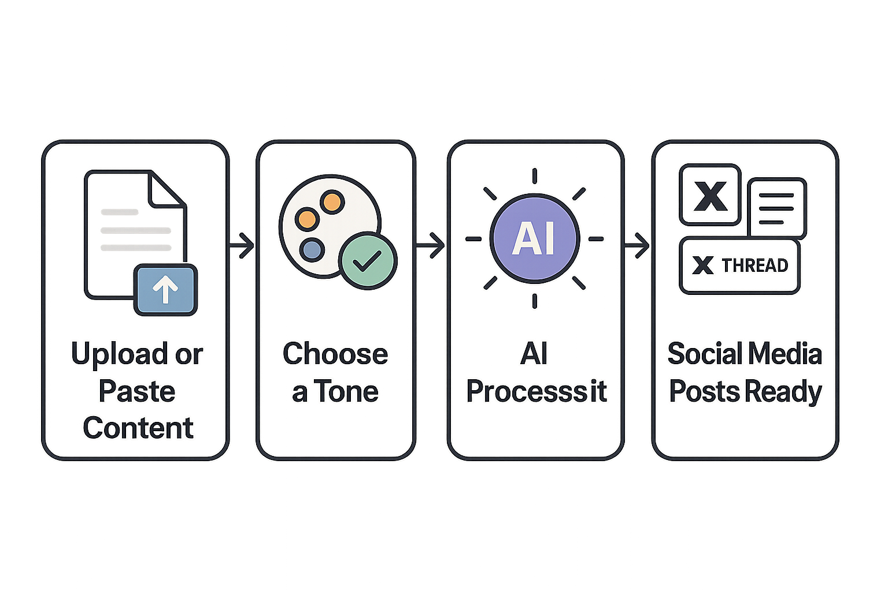

# Postmorph

## Overview

Postmorph helps content creators and marketers save a ton of time by quickly transforming their existing content into many different formats. You simply provide your original content, tell it what you need, and it takes care of adapting it for various platforms, so you don't have to start from scratch every time you want to post somewhere new.

## Features

*   **Intelligent Content Repurposing**: Effortlessly transform long-form content like blog posts or videos into bite-sized social media updates, threads, and more.
*   **Multi-Platform Output**: Generate tailored content for various platforms including X (formerly Twitter) threads, individual tweets, LinkedIn posts, and Reddit posts.
*   **Video-to-Text Transcription**: Automatically transcribe and summarize content from YouTube and TikTok videos, turning spoken words into editable text.
*   **AI-Powered Content Refinement**: Easily modify and enhance your drafts with AI suggestions to fit different tones or specific requirements.
*   **Custom Brand Voices**: Define and apply unique writing styles and instructions to ensure all repurposed content consistently reflects your brand's voice.
*   **Draft Management**: Save, organize, edit, and delete your generated content drafts, giving you full control over your creative process.
*   **Flexible Credit System**: Operate on a convenient pay-as-you-go model, purchasing credits as needed without commitment to subscription fees.
*   **Integrated Learning Center**: Access comprehensive guides and resources to master content repurposing and maximize your results.

## Getting Started

To get Postmorph up and running locally, follow these steps:

### Installation

1.  **Clone the Repository**:
    ```bash
    git clone git@github.com:Charmingdc/postmorph
    ```
2.  **Navigate to the project directory**:
    ```bash
    cd postmorph
    ```
3.  **Install dependencies**:
    Using npm:
    ```bash
    npm install
    ```
    Using yarn:
    ```bash
    yarn install
    ```

### Environment Variables

You'll need to set up your environment variables. Copy the `.env.template` file to `.env.local` and fill in the necessary details.

```bash
cp .env.template .env.local
```

Here are the variables you'll need:

| Variable                          | Description                                            | Example Value                                  |
| :-------------------------------- | :----------------------------------------------------- | :--------------------------------------------- |
| `NEXT_PUBLIC_APP_URL`             | The public URL of your Next.js application.            | `http://localhost:3000`                        |
| `NEXT_PUBLIC_SUPABASE_URL`        | Your Supabase project URL.                             | `https://your-project-id.supabase.co`          |
| `NEXT_PUBLIC_SUPABASE_ANON_KEY`   | Your Supabase public anon key.                         | `your-supabase-anon-key`                       |
| `SUPABASE_SERVICE_ROLE_KEY`       | Your Supabase service role key (for server actions).   | `your-supabase-service-role-key`               |
| `GOOGLE_GENERATIVE_AI_API_KEY`    | API key for Google Gemini AI.                          | `your-google-ai-api-key`                       |
| `SUPADATA_API_KEY`                | API key for Supadata (for video transcription).        | `your-supadata-api-key`                        |
| `DODO_PAYMENTS_API_KEY`           | API key for Dodo Payments.                             | `your-dodopayments-api-key`                    |
| `DODO_PAYMENTS_WEBHOOK_KEY`       | Webhook secret for Dodo Payments.                      | `your-dodo-payment-webhook-secret`             |
| `DODO_PAYMENTS_ENVIRONMENT`       | The environment for Dodo Payments (`live_mode` or `test_mode`). | `test_mode`                                    |

## Usage

Once you've installed the dependencies and configured your environment variables, you can start the development server:

```bash
npm run dev
# or
yarn dev
```

Open your browser and navigate to `http://localhost:3000`.

From the landing page, you can learn more about Postmorph or sign up to start transforming your content.

### Content Repurposing Workflow

1.  **Sign Up/Sign In**: Create an account or log in to access the dashboard.
2.  **Navigate to "Repurpose New"**: In the dashboard sidebar, select "Repurpose New."
3.  **Choose Formats**:
    *   Select your "Input Format" (e.g., "blog", "youtube video", "x thread").
    *   Choose your desired "Output Format" (e.g., "tweet", "linkedin post").
    *   Pick a "Tone" that fits your needs. You can use default tones or create custom ones.
4.  **Provide Content**: Paste a link (for videos/blogs) or the text content into the input area.
5.  **Repurpose**: Click "Repurpose Now" and let the AI work its magic.
6.  **Review and Edit**: Your new draft will appear. You can copy it, or click the edit icon to open it in the editor for further adjustments.

Here is a quick look at the core workflow:



Postmorph helps modern creators get more mileage out of their content.


## Technologies Used

| Technology         | Description                                     |
| :----------------- | :---------------------------------------------- |
| **Next.js**        | React framework for production                  |
| **React**          | Frontend JavaScript library                     |
| **TypeScript**     | Strongly typed JavaScript                       |
| **Tailwind CSS**   | Utility-first CSS framework                     |
| **Supabase**       | Backend-as-a-Service (Auth, Database, Storage)  |
| **Google Gemini**  | AI model for content generation                 |
| **Dodo Payments**  | Payment gateway integration                     |
| **TanStack Query** | Data fetching and state management              |
| **Framer Motion**  | Animations and gestures for React               |
| **JSDOM**          | Parses and manipulates HTML and XML             |
| **Mozilla Readability** | Extracts main content from a web page      |
| **Supadata**       | Handles video transcription                     |
| **Zod**            | Schema validation                               |
| **Sonner**         | Toast notifications                             |
| **Vercel Analytics & Speed Insights** | Performance monitoring and analytics |

## Contributing

We welcome contributions to Postmorph! If you're interested in helping out, please follow these guidelines:

1.  **Fork the repository**.
2.  **Create a new branch** for your feature or bug fix: `git checkout -b feature/your-feature-name` or `git checkout -b bugfix/issue-description`.
3.  **Make your changes**, ensuring that your code adheres to the project's coding style and practices.
4.  **Write clear, concise commit messages**.
5.  **Push your branch** and open a pull request.
6.  Provide a clear description of your changes and why they are needed.

Please ensure your code is well-tested and that all checks pass before submitting a pull request.

## Author Info

**Charming Dc**

*   X (formerly Twitter): [@Charmingdc01](https://x.com/Charmingdc01)
*   LinkedIn: [Your LinkedIn Profile](https://www.linkedin.com/in/charming-dc-a21235227/) (Please replace with your actual profile link)

## Badges

[](https://nextjs.org/)
[](https://react.dev/)
[](https://www.typescriptlang.org/)
[](https://tailwindcss.com/)
[](https://supabase.com/)
[](https://gemini.google.com/)
[](https://dodopayments.com/)
[](https://vercel.com/)

[](https://www.npmjs.com/package/dokugen)